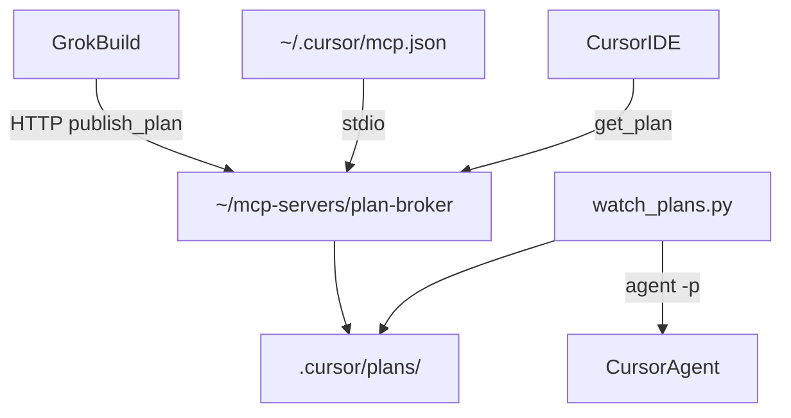

# Setup — Fluxo Nível 2: Grok Build → PlanBroker MCP → Cursor

> **Uso completo como agente de planejamento** (obrigação de `publish_plan`, todos os cenários, chamadas MCP exatas, integração Notion): leia **[PLAN_BROKER_GUIDE.md](PLAN_BROKER_GUIDE.md)** primeiro. Este arquivo é o runbook de **setup único** + referência de arquitetura.

Handoff entre **planejamento** (Grok Build) e **implementação** (Cursor) via MCP.

## Quick Start

```powershell
# 1. Setup único (broker + global MCP + watcher deps)
.\scripts\setup-mcp-flow.ps1

# 2. Verificar
.\scripts\verify-mcp-flow.ps1

# 3. Iniciar stack (HTTP + watcher)
.\scripts\start-mcp-flow.ps1

# 4. Parar
.\scripts\stop-mcp-flow.ps1
```

**Manual (obrigatório uma vez):** `agent login` e Run Mode → Auto-review no Cursor.

---

## Arquitetura

```txt
~/mcp-servers/plan-broker/     ← MCP server (reutilizável, git opcional)
~/.cursor/mcp.json             ← plan-broker global (stdio)

Portfolio/                     ← versionado no git
  .cursor/mcp.json             ← vazio (servers no global)
  .cursor/permissions.json     ← auto-approve PlanBroker tools
  .cursor/plans/               ← planos por projeto
  .cursor/rules/plan-orchestration.md
  watch_plans.py
  scripts/
    setup-mcp-flow.ps1
    start-mcp-flow.ps1
    stop-mcp-flow.ps1
    switch-mcp-workspace.ps1
    verify-mcp-flow.ps1
    mcp-global.json.example
```



---

## Pré-requisitos

| Ferramenta | Instalação |
|------------|------------|
| Python 3.10+ | python.org |
| Cursor IDE | Run Mode: Auto-review |
| Cursor CLI | `irm 'https://cursor.com/install?win32=true' \| iex` |
| agent login | Interativo — não automatizável |

---

## 1. Setup único (`setup-mcp-flow.ps1`)

Executa automaticamente:

1. `~/mcp-servers/plan-broker/install.ps1` — deps, uv, git init
2. `pip install -r requirements-watch.txt`
3. Mescla `plan-broker` em `~/.cursor/mcp.json` (backup: `mcp.json.bak`)
4. Verifica `agent status`

### MCP global (não duplicar no projeto)

O [`.cursor/mcp.json`](.cursor/mcp.json) do projeto está **vazio** — o broker vive em `~/.cursor/mcp.json`:

```json
{
  "mcpServers": {
    "plan-broker": {
      "type": "stdio",
      "command": "powershell",
      "args": ["-NoProfile", "-ExecutionPolicy", "Bypass", "-File", "~/mcp-servers/plan-broker/run-broker.ps1"],
      "env": { "WORKSPACE_FOLDER": "${workspaceFolder}" }
    }
  }
}
```

`${workspaceFolder}` garante que cada projeto recebe planos no diretório correto.

**Se já tiver outros MCP servers:** o setup faz merge; revise `mcp.json.bak` se necessário.

---

## 2. Permissões MCP

[`.cursor/permissions.json`](.cursor/permissions.json) allowlista as 4 tools:

- `plan-broker:publish_plan`
- `plan-broker:get_latest_plan`
- `plan-broker:list_plans`
- `plan-broker:get_plan`

**Requer Run Mode ativo** (Settings → Auto-review ou Allowlist). Não funciona em "Ask Every Time".

---

## 3. Operação diária

### Iniciar stack

```powershell
.\scripts\start-mcp-flow.ps1
# Opções:
.\scripts\start-mcp-flow.ps1 -Workspace "C:\path\to\project"
.\scripts\start-mcp-flow.ps1 -NoWatch              # só HTTP, sem watcher
.\scripts\start-mcp-flow.ps1 -DryRunWatch          # watcher simula
.\scripts\start-mcp-flow.ps1 -RunAgent            # watcher dispara agent CLI (headless)
.\scripts\start-mcp-flow.ps1 -Port 8765
```

Inicia:

- PlanBroker HTTP → `http://127.0.0.1:8765/mcp` (Grok Build)
- `watch_plans.py` em **notify-only** (padrão): notifica + copia prompt para o Cursor IDE

Para headless CLI (terminal, fora do IDE): `.\scripts\start-mcp-flow.ps1 -RunAgent`

PIDs salvos em `.cursor/plans/.mcp-flow.pids`.

### Parar stack

```powershell
.\scripts\stop-mcp-flow.ps1
```

### Trocar de projeto (multi-projeto)

```powershell
.\scripts\switch-mcp-workspace.ps1 -Workspace "C:\path\to\outro-projeto"
```

Grava workspace ativo em `.cursor/plans/.active-workspace`.

### Verificar saúde

```powershell
.\scripts\verify-mcp-flow.ps1
```

---

## 4. Grok Build

1. `.\scripts\start-mcp-flow.ps1` (ou broker HTTP manual)
2. Configure MCP: `http://127.0.0.1:8765/mcp`
3. Use o prompt da seção 6

---

## 5. Tools MCP

| Tool | Descrição |
|------|-----------|
| `publish_plan` | Publica plano + metadados |
| `get_latest_plan` | Plano mais recente |
| `list_plans` | Lista metadados |
| `get_plan` | Plano por task_id |

---

## 6. Prompt para Grok Build

```markdown
Você é o agente de PLANEJAMENTO para o repositório Portfolio (Next.js + .NET).

## Objetivo
Gerar plano detalhado e publicar via MCP PlanBroker.

## Formato (Markdown)
# {Título}
## Contexto / Objetivo / Escopo
## BDD (Gherkin)
## Passos ordenados
## Arquivos prováveis
## Testes obrigatórios
## Validação final

## task_id
Kebab-case: feat-contact-validation

## Publicação OBRIGATÓRIA
Tool: publish_plan
Args: plan_markdown, task_id, metadata
metadata: { "source": "grok-build", "areas": ["backend"], "priority": "normal" }

NÃO encerre sem publish_plan com status "ok".
```

---

## 7. Teste end-to-end

```powershell
.\scripts\setup-mcp-flow.ps1
.\scripts\verify-mcp-flow.ps1
.\scripts\start-mcp-flow.ps1 -DryRunWatch

# Publicar manualmente
$env:WORKSPACE_FOLDER = (Get-Location).Path
cd $HOME\mcp-servers\plan-broker
python -c "from plan_broker import publish_plan; print(publish_plan('# Test','test-e2e',{}))"

# Watcher
cd C:\Users\lucas\Documents\Projects\Portfolio
python watch_plans.py --once test-e2e --dry-run

.\scripts\stop-mcp-flow.ps1
```

No Cursor: `Use plan-broker get_plan com task_id test-e2e`

---

## 8. Exemplo real: POST /api/contact

| # | Ação |
|---|------|
| 1 | `.\scripts\start-mcp-flow.ps1` |
| 2 | Grok Build planeja → `publish_plan` → `feat-contact-validation.md` |
| 3 | Watcher dispara agent OU você pede: *"Implemente latest plan"* |
| 4 | Cursor implementa + valida dotnet/npm |
| 5 | Você revisa e pede commit |

---

## 9. Versionamento de planos

Republicar mesmo `task_id` arquiva `{task_id}.v{N}.md` e incrementa versão.

---

## 10. Segurança

| Risco | Mitigação |
|-------|-----------|
| Secrets no plano | Nunca incluir credenciais |
| HTTP exposto | Apenas `127.0.0.1` |
| `agent --force` | Ambiente confiável apenas |
| Multi-projeto | `switch-mcp-workspace.ps1` ou `-Workspace` |

---

## 11. Troubleshooting

| Problema | Solução |
|----------|---------|
| MCP não conecta | Reinicie Cursor; rode `setup-mcp-flow.ps1` |
| `WORKSPACE_FOLDER` | Definido em global mcp.json env |
| uv ausente | `run-broker.ps1` usa python automaticamente |
| Tools pedem aprovação | Ative Run Mode + `permissions.json` |
| agent não encontrado | Instale CLI + `agent login` |
| Plano no projeto errado | Verifique `-Workspace` no start/switch |

---

## Pendências manuais

| Item | Motivo |
|------|--------|
| `agent login` | OAuth interativo |
| Run Mode no Cursor | Setting da IDE |
| Merge MCP global | Revisar `~/.cursor/mcp.json.bak` se tinha servers |
